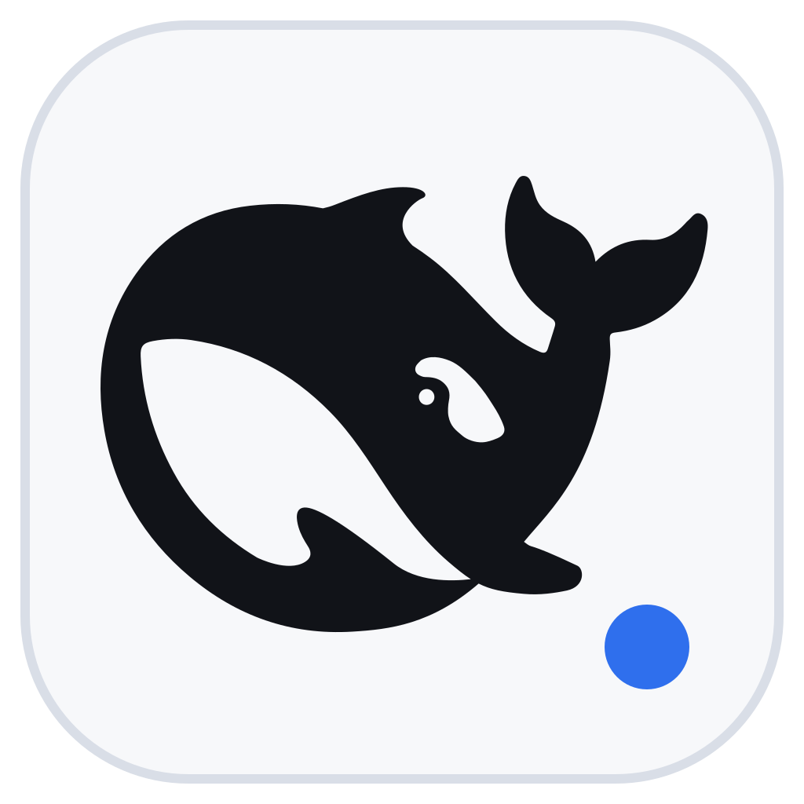

# DeepSeek Harness Desktop

[](https://github.com/shuimowang/deepseek-harness-desktop/actions/workflows/build.yml)
[](https://github.com/shuimowang/deepseek-harness-desktop/releases/latest)
[](LICENSE)

面向 Windows x64 的轻量原生桌面客户端，用于启动和承载
[DeepSeek Harness](https://github.com/deepseek-ai/deepseek-harness) 官方 Web UI。

> 本项目是非官方社区封装，与 DeepSeek AI 没有隶属或背书关系。DeepSeek 与
> DeepSeek Harness 名称及相关品牌资产归其权利人所有。

<p align="center">
  
</p>

## 下载

- [GitHub 最新版](https://github.com/shuimowang/deepseek-harness-desktop/releases/latest)

推荐普通用户下载文件名带 `-online` 的在线轻量版。每个发布包都同时提供
`.sha256` 校验文件。

## 功能

- 原生 WPF 窗口和 Edge WebView2，不额外携带 Chromium。
- 单实例运行；重复打开会唤起现有窗口。
- 固定使用经过验证的 `@deepseek-ai/dsh@0.1.1-rc.2`。
- 完整便携包内置 Node.js 24.14.1、DSH 和 .NET 10 Desktop Runtime。
- 优先复用 `127.0.0.1:3080` 上已有的 Harness；端口被其他程序占用时自动选择空闲端口。
- 连续探测服务健康状态，异常退出后自动恢复一次。
- 仅关闭客户端自己启动的服务，不终止外部 Harness 进程。
- 跨域链接交给系统浏览器，WebView2 只保留本地 Harness 页面。
- 可选择工作目录、重新连接、刷新、查看启动日志或在浏览器中打开。
- WebView2 不可用时提供系统浏览器模式，不会自动启动外部程序。

## 给普通用户

### 在线轻量版（推荐分享）

`DeepSeekHarness-1.2.0-win-x64-online.zip` 小于 100 MB，适合 GitHub Release
和蓝奏云。

#### 运行环境

- Windows 10 或 Windows 11 x64。
- 首次启动时能访问 `nodejs.org` 和 `registry.npmjs.org`。如果使用代理、公司网络或防火墙，需要允许访问这两个地址。
- 普通用户权限即可，不需要以管理员身份运行。
- 解压目录、`%LOCALAPPDATA%` 和“文档”目录需要有写入权限。
- 内嵌界面需要 Microsoft Edge WebView2 Runtime；Windows 10/11 通常已经包含。缺失时客户端仍可运行，并会提示用户点击后在系统默认浏览器中打开。
- 使用模型时，仍需按照 DeepSeek Harness 的要求配置可用的模型服务和 API 凭据；客户端不会附送模型额度或密钥。

在线轻量版**不需要预装** .NET Runtime、Node.js、npm、DeepSeek Harness 或 Git。客户端为自包含发布，缺少的 Node.js 和 DeepSeek Harness 会在首次启动时自动准备。

#### 首次启动

客户端会自动：

1. 从 nodejs.org 下载并校验 Node.js 24.14.1；
2. 从 npm 安装固定版 `@deepseek-ai/dsh@0.1.1-rc.2`；
3. 将运行时保存到 `%LOCALAPPDATA%\DeepSeekHarness\Runtime`，后续启动和客户端更新直接复用。

首次安装受网络、代理速度和电脑性能影响，可能需要 5 至 20 分钟。不要在安装过程中强制结束进程；正常关闭窗口会安全取消安装。客户端升级后，只要内置的运行时版本没有变化，就不需要重新下载。

不要只按约 63 MB 的 ZIP 大小预留空间。当前版本解压后约占 142 MiB，首次准备的 Node.js、DeepSeek Harness 和 npm 缓存合计约占 490 MiB，WebView2 用户数据还会随使用增长。建议磁盘至少预留 **1 GB** 可用空间。

### 离线完整版

从发布包中获取 `DeepSeekHarness-1.2.0-win-x64.zip`：

1. 将 ZIP 完整解压到一个普通文件夹，不要直接在压缩包里运行。
2. 双击 `DeepSeekHarness.exe`。
3. 如需桌面和开始菜单入口，右键运行 `Install-DesktopShortcut.ps1`，或在 PowerShell 中执行：

```powershell
powershell -ExecutionPolicy Bypass -File .\Install-DesktopShortcut.ps1 -Launch
```

移除快捷方式：

```powershell
powershell -ExecutionPolicy Bypass -File .\Install-DesktopShortcut.ps1 -Remove
```

离线完整版已包含 Node.js、DeepSeek Harness 和客户端所需的 .NET 运行时，首次启动无需联网下载或安装这些组件，也不需要管理员权限。Windows 10/11 通常已包含 Microsoft Edge WebView2 Runtime；缺失时客户端会提示用户点击后在默认浏览器中打开 Harness。

“离线”只表示本地运行环境无需在线安装。实际调用云端模型时，仍然需要网络连接、可用的模型服务和对应的 API 凭据。

当前发布物未购买商业代码签名证书，Windows SmartScreen 可能提示“未知发布者”。发布者应同时提供
`.sha256` 文件，用户可用以下命令核对下载完整性：

```powershell
Get-FileHash .\DeepSeekHarness-1.2.0-win-x64.zip -Algorithm SHA256
```

## 数据位置

- 客户端设置：`%LOCALAPPDATA%\DeepSeekHarness\desktop-settings.json`
- WebView2 数据：`%LOCALAPPDATA%\DeepSeekHarness\WebView2`
- 默认工作目录：`文档\DeepSeek Harness Workspace`
- Harness 自身的会话、模型和插件数据仍遵循官方 DSH 的数据目录规则。

客户端不会在安装目录保存用户会话。升级时可以直接替换程序文件夹。

从包含 DSH `0.1.0-rc.7` 的旧版客户端升级前，建议先备份 Harness 数据目录和默认工作目录。DSH `0.1.0-rc.8` 起调整了 SQLite 存储格式，不建议让新旧版本交替打开同一份数据。客户端会自动更新 DSH 管理的旧版依赖链接，不会删除链接目标或用户会话数据。

## 从源码运行

开发模式需要：

- Windows x64
- .NET 10 SDK
- Node.js `^22.19.0` 或 `>=24.0.0`
- Microsoft Edge WebView2 Runtime

```powershell
dotnet restore .\DshDesktop.csproj
dotnet run --project .\DshDesktop.csproj
```

开发模式没有内置运行时，会通过系统 `npx` 启动固定版本的 DSH。

## 构建可分享便携包

在线轻量版：

```powershell
powershell -ExecutionPolicy Bypass -File .\scripts\Build-Release.ps1 -OnlineLite
```

离线完整版：

```powershell
powershell -ExecutionPolicy Bypass -File .\scripts\Build-Release.ps1
```

脚本执行以下工作：

- 自包含发布 Windows x64 WPF 客户端；
- 从 nodejs.org 下载 Node.js，并按官方 `SHASUMS256.txt` 校验；
- 安装固定版本的 DeepSeek Harness；
- 写入运行时清单和第三方声明；
- 在 `artifacts` 目录生成 ZIP 与 SHA-256 文件。

只构建不带 Node/DSH 的小型客户端：

```powershell
.\scripts\Build-Release.ps1 -SkipRuntimeBundle
```

## 项目边界

客户端不修改或复刻 Harness UI。模型、会话、工具、插件和 Agent 能力均由官方
`@deepseek-ai/dsh` 提供；本项目只负责 Windows 窗口、运行时准备、进程生命周期、健康检查与发布。

本项目源码使用 [MIT License](LICENSE)。第三方组件和图标来源见
[THIRD_PARTY_NOTICES.md](THIRD_PARTY_NOTICES.md)。
